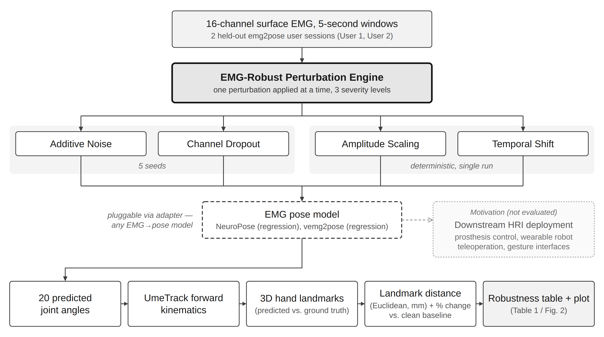
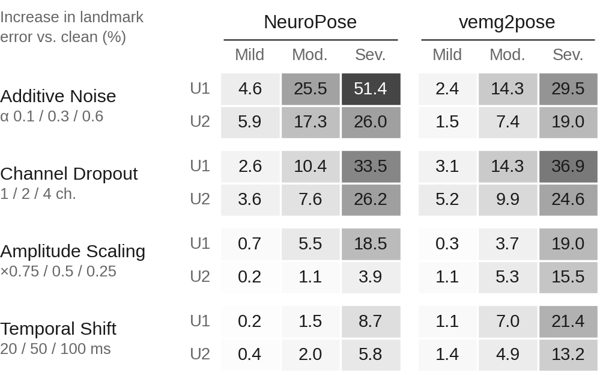

# EMG-Robust

A lightweight toolkit for stress-testing EMG-based hand-pose models under controlled input perturbations.

EMG-Robust applies one perturbation at a time to held-out surface-EMG recordings, at three severity levels: additive noise, channel dropout (the selected channels are zeroed), amplitude scaling, and temporal shift (the signal is delayed, zero-padded at the start). It runs a pose model on the perturbed input and reports how much the 3D hand-landmark error grows relative to clean input. Models plug in through a thin adapter, so the same sweep can be run on other EMG→pose models.



## Perturbations

| Perturbation | Swept parameter | Mild | Moderate | Severe | Runs per level |
|---|---|--:|--:|--:|---|
| Additive noise | noise std = α · σ<sub>c</sub> | α = 0.1 | 0.3 | 0.6 | 5 seeds |
| Channel dropout | channels zeroed (of 16) | 1 | 2 | 4 | 5 seeds |
| Amplitude scaling | gain | ×0.75 | ×0.5 | ×0.25 | 1 (deterministic) |
| Temporal shift | delay τ | 20 ms | 50 ms | 100 ms | 1 (deterministic) |

σ<sub>c</sub> is the standard deviation of channel *c* within the 5-s window being perturbed. The shift delays the signal (zero-padded at the start) and is applied in samples (40 / 100 / 200 at 2 kHz). For each model × user, a sweep is 37 runs: 1 clean, 15 noise, 15 dropout, 3 amplitude and 3 shift.

## Quick start: reproduce Table 1 and Fig. 2 (no dataset or GPU needed)

```bash
pip install pandas numpy matplotlib   # all that make_report.py needs
python scripts/make_report.py
```

This reads the sweep results shipped in `results/` and writes `report/` in a few seconds:

| File | Contents |
|---|---|
| `report/summary.csv` | One row per model × user × perturbation × level: mean and SD of the error in mm, and % change vs. clean, for landmark and fingertip error |
| `report/runs_with_pct.csv` | Every run with its clean baseline and % change |
| `report/table1.tex`, `table1.md` | Table 1: clean and severe-level error (mm) |
| `report/fig2_heatmap.pdf`, `.png` | Fig. 2: % change for all 48 conditions |
| `report/fig2.tex` | LaTeX figure block with caption and `\Description` |

The % change is computed for every run against the clean baseline of the same model and user session, `(perturbed − clean) / clean × 100`, and then averaged over seeds. Negative values are kept, not clipped. Use `--metric fingertip` for the same report on fingertip error, and `--readme README.md` to refresh the results table below.

Want a feel for the perturbations themselves first? `notebooks/demo.ipynb` runs the real `emg_robust/perturbations.py` functions on a synthetic signal and a toy model — add `torch` (CPU) to the three packages above and it needs no dataset, checkpoints or GPU either.

## Run a sweep

One-time setup — emg2pose and its UmeTrack submodule aren't on PyPI, and the repo needs a small patch to import under Python 3.13 (it was written for 3.10; a type-hint style that needs deferred annotation evaluation). `bash scripts/setup_emg2pose.sh` does the steps below for you:

```bash
git clone https://github.com/facebookresearch/emg2pose.git emg2pose_repo
python -c "
from pathlib import Path
p = Path('emg2pose_repo/emg2pose/kinematics.py')
src = p.read_text()
if 'from __future__ import annotations' not in src:
    p.write_text('from __future__ import annotations\n' + src)
"
pip install -e emg2pose_repo -e emg2pose_repo/emg2pose/UmeTrack
pip install -r requirements.txt
```

Then run a sweep:

```bash
python scripts/run_sweep.py --model neuropose --user 1
python scripts/run_sweep.py --model vemg2pose --user 2
```

`--model` is `neuropose` or `vemg2pose`; `--user` is `1` or `2`. The official checkpoints and both held-out sessions (the mini subset for User 1, a second session streamed from the full archive for User 2) are downloaded automatically into `.cache/` on first use — no manual data setup needed. Add `--out <path>` to override the default `results/final_<model>_user<N>.csv`, or `--cache <dir>` to change where downloads are cached. Each sweep writes one CSV to `results/`, with one row per run:

| Column | Meaning |
|---|---|
| `model` | Model name (`neuropose`, `vemg2pose`, …) |
| `user_session` | emg2pose session ID of the held-out user |
| `perturbation` | `baseline`, `noise`, `dropout`, `amplitude` or `temporal_shift` |
| `level` | `none`, `mild`, `moderate` or `severe` |
| `value` | Swept parameter: α (noise), channels zeroed (dropout), gain (amplitude), or delay in samples (temporal shift) |
| `seed` | Random seed (stochastic perturbations only) |
| `landmark_mm` | 3D hand-landmark distance (Euclidean, mm) |
| `fingertip_mm` | Same, fingertip landmarks only (mm) |
| `dropped_channels` | Channel indices zeroed (dropout only) |

`make_report.py` takes the user label (U1, U2, …) from `user<N>` in the file name, e.g. `final_neuropose_user1.csv`.

## Add your own model

`emg_robust/adapter.py` wraps a loaded model in a class with one method:

```python
class ModelAdapter:
    def predict(self, batch: dict):
        """batch = {"emg", "joint_angles", "no_ik_failure"}; returns (pred, target, mask)
        in emg2pose's own format, which emg_robust/metrics.py feeds straight into
        emg2pose.metrics.LandmarkDistances."""
```

`load_model(name, ckpt_dir)` builds this for emg2pose's own checkpoints (`"neuropose"`, `"vemg2pose"`). To stress-test a different EMG→pose model, write your own loader returning an object with that same `.predict()` signature — nothing else in the toolkit (perturbations, metrics, sweep, report) depends on the model's internals, only on this one call. For example, a plain PyTorch model that maps EMG directly to joint angles (no FK, no mask):

```python
class PlainModelAdapter:
    def __init__(self, model):
        self.model = model

    def predict(self, batch):
        pred_angles = self.model(batch["emg"])          # [batch, time, 20]
        return pred_angles, batch["joint_angles"], batch["no_ik_failure"]

model_adapter = PlainModelAdapter(your_loaded_model)
loader = sweep.build_loader(session_dir)
sweep.run_sweep(model_adapter, loader, "your_model", user_session, out_path)
```

## Results

<!-- report:table1:start -->
Landmark error (mm), clean vs. **severe** level (± = SD over 5 seeds):

| Model | User | Clean | Noise | Dropout | Amp. | Shift |
|---|---|--:|--:|--:|--:|--:|
| NeuroPose | U1 | 18.95 | 28.68 ± 0.02 | 25.28 ± 1.34 | 22.45 | 20.59 |
|  | U2 | 20.16 | 25.41 ± 0.06 | 25.45 ± 1.22 | 20.95 | 21.33 |
| vemg2pose | U1 | 16.56 | 21.45 ± 0.08 | 22.66 ± 1.29 | 19.71 | 20.10 |
|  | U2 | 18.63 | 22.16 ± 0.06 | 23.20 ± 1.33 | 21.52 | 21.08 |
<!-- report:table1:end -->



Fig. 2: Increase in landmark error (%) relative to each user–model clean baseline; darker cells are larger increases. Noise and dropout cells average 5 seeds, except mild dropout, where a seed collision (see *Notes and limitations*) leaves 4 distinct channel sets across the 5 runs.

## Notes and limitations

- **Scope.** Two held-out emg2pose users (U1 = session `d387095792`, U2 = session `29ddab35d7`) and two models. The results demonstrate the toolkit; they are not a statistical comparison of models.
- **Mild dropout.** Seeds 0 and 2 both drop channel 13, so the mild level covers 4 distinct channel sets in 5 runs. The shipped results are reported as-run, without resampling to avoid the collision. `make_report.py` prints this check whenever it finds repeated channel sets.
- **Noise scale.** σ<sub>c</sub> is computed per window, so the noise level follows each window's own signal level.
- **Fingertip error** is in `report/summary.csv`. Its % change closely tracks landmark error (r = 0.997 across the 48 conditions).

## Repository layout

```
emg-robust/
├── emg_robust/
│   ├── perturbations.py   # the four perturbation operators
│   ├── adapter.py         # loads a model (NeuroPose, vemg2pose, or your own)
│   ├── metrics.py         # landmark-distance evaluation (wraps emg2pose.metrics)
│   ├── data.py            # fetches checkpoints + the two held-out sessions
│   └── sweep.py           # builds the 37-config sweep and runs it
├── scripts/
│   ├── run_sweep.py       # CLI: run the sweep for one model and user
│   └── make_report.py     # Table 1, Fig. 2 and summary CSVs from results/
├── results/               # sweep CSVs used in the paper
├── report/                # generated by make_report.py
├── notebooks/demo.ipynb
├── docs/figure1_pipeline.png
├── requirements.txt
└── LICENSE
```

## Data, models and licenses

The emg2pose dataset, code and pretrained checkpoints are released by their authors under CC BY-NC-SA 4.0, and UmeTrack under CC BY-NC 4.0. Neither is redistributed here; `scripts/run_sweep.py` downloads them automatically from the [emg2pose repository](https://github.com/facebookresearch/emg2pose) and its own public S3 bucket.

EMG-Robust's own code (everything in `emg_robust/` and `scripts/`) is released under the MIT License (see `LICENSE`) — it only imports emg2pose, it does not copy any of its source.

`make_report.py` was tested with Python 3.11, pandas 3.0, NumPy 2.4 and Matplotlib 3.10.

## Citation

[anonymized for review]
